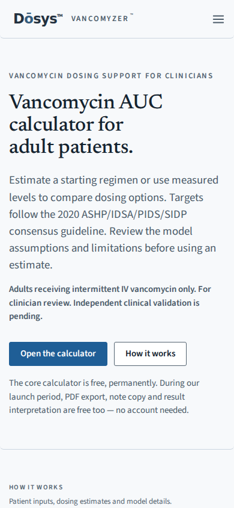
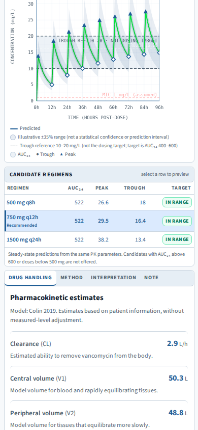
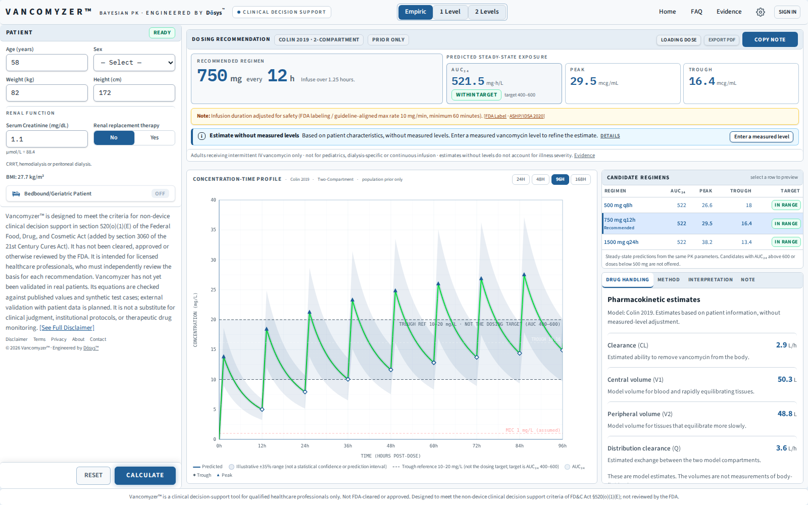
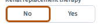

# Direction A fixes and verification

Reviewed 21 September 2026. These are local production-build results, not hosted CI results or clinical validation.

## Changes

- Fix the clipped keyboard focus ring in segmented controls; preserve inset focus in result tabs and candidate rows.
- Give calculator header actions white text/icons on their dark hover background. Measured contrast: **6.775:1**.
- Render the light theme on the server so the homepage remains readable before JavaScript starts, including with JavaScript disabled.
- Remove decorative checkmarks and arrows from page copy and status badges. Use text for success, inclusion, disclosure and recommendation states. Keep functional checkboxes, clinical warning symbols and graph data markers.
- Replace internal terminology and promotional filler with specific labels, including “Enter a measured level,” “Estimate without measured levels,” and “Comparison with Tucuxi.” Keep model terminology, evidence qualifications and clinical limitations.
- Use square table cells and a visible Recommended label. Refresh the homepage illustration from the actual calculator with synthetic inputs.
- Fix mobile overflow on the published-case and Tucuxi comparison pages. Wide data tables remain locally scrollable.

## Verification

| Check | Result | Evidence |
| --- | --- | --- |
| `npm run build` | Exit 0; 101 static pages generated | [Build log](build.log) |
| `npm test` | Exit 0; PK integration, 254 oracle assertions, 56 horizon assertions, published cases, 18/18 required safety/report categories and 59 study-readiness checks pass | [Test log](tests.log) |
| `npm run test:market-intel` | Exit 0; analyst and collection tests pass | [Market tests](market-tests.log) |
| Browser regression script | Exit 0; server-render contrast, hover contrast, inset focus, consent and page scans pass; no uncaught page errors | [Browser results](browser.jsonl) |
| Result lifecycle | All 7 assertions pass | [Lifecycle log](lifecycle.log) |
| Source audit | All 45 page sources and shared components reviewed for symbols and copy | [Route inventory](route-inventory.txt) |

Browser command, from `website` after building:

```sh
node scripts/e2e/direction-a-review.mjs
```

`PW_CHROMIUM` optionally selects an installed Chromium binary. `FONT_CACHE_DIR` optionally supplies the unchanged Google Fonts CSS as `index.css` and its font files for offline checking. `UPDATE_CALCULATOR_IMAGE=1` refreshes the synthetic homepage screenshot. This run used Chromium 153, cached Newsreader/Source Sans 3/IBM Plex Mono font files, and reduced-motion mode for stable graph captures. Homepage widths checked: 320, 390, 820, 1024 and 1440 pixels. Calculator checked on desktop and at 390 pixels.

The route scan covers 20 rendered unauthenticated pages plus the expected authentication redirect from `/upgrade/department`, as well as the calculator interaction checks. Authenticated admin, billing, research and account pages were reviewed in source; authenticated transactions were not exercised. Browser checks were in Chromium, not physical-device Safari. Existing lint/Browserslist warnings remain in the build log.

Synthetic calculator case: age 58, weight 82 kg, height 172 cm, SCr 1.1 mg/dL, no RRT and no measured levels. It still returns the same candidate AUC values as the reviewed branch: 522 after display rounding, with the 750 mg every 12 h option recommended. Dosing algorithms and numeric thresholds are unchanged.

## Visual examples








